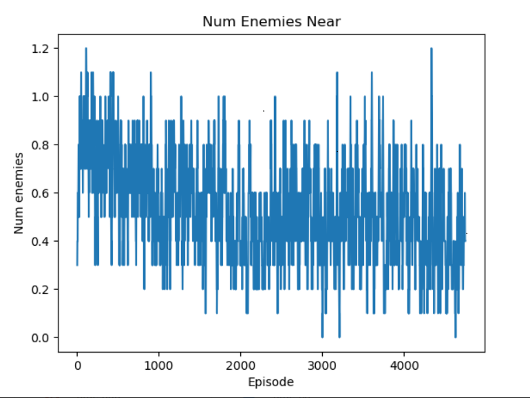
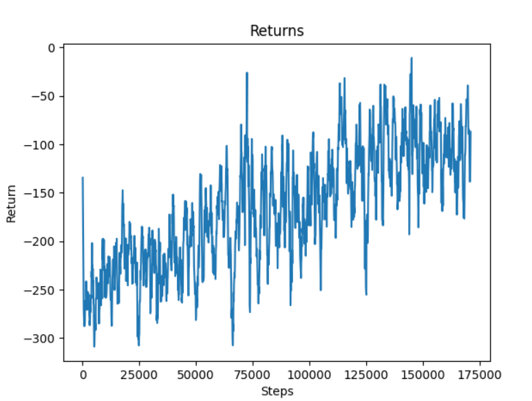
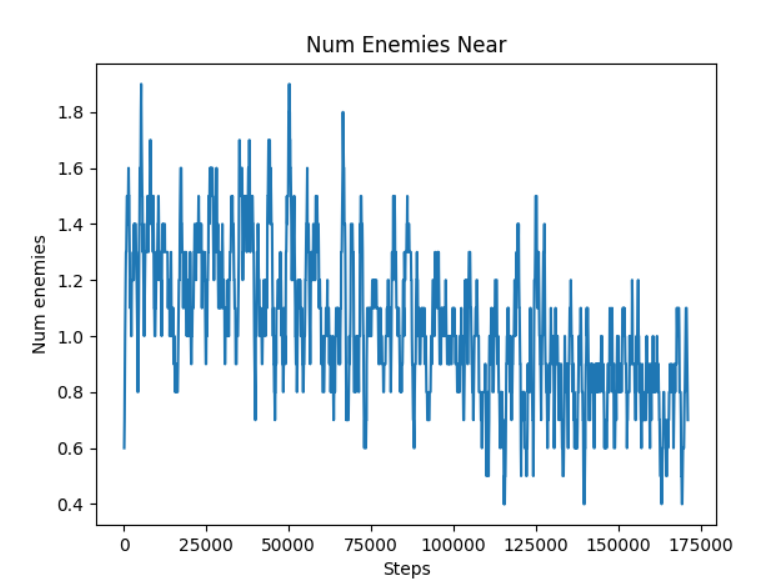
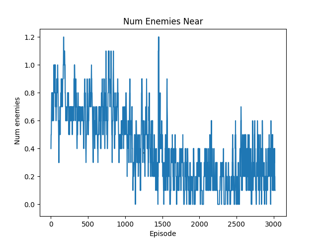

## VIDEO:

## PROJECT SUMMARY: 

The goal of our project is to train our agent to be adept at evading hostile mobs such as zombies, skeletons, and creepers while learning that passive mobs like cows, sheep, and pigs are safe. This is an interesting thing to do because a common issue for Minecraft players is trying to avoid death via hostile mobs in their first few in-game nights. It will be interesting to see if an AI trained with reinforcement learning would be able to mimick the same escape strategies employed by human players.
 
 Our project as of now has an agent in an eclosed room with 2 zombies, 2 creepers and 3 sheeps. The enclosed room has a row of diamond blocks. If the agent reaches any block in this row, the agent wins and gets a reward for the same. The enclosed room also has a path towards the diamond blocks of least resistance i.e devoid of hostile mobs. The agent detects the best path to reach the diamond blocks and escapes the hostile.  

## APPROACH: 
__Baseline__: Our baseline for this project was for an agent to escape a single zombie on an open field. Our agent successfully did this 
by consistently running away from its spawn point in a straight line. While this was a success, it didn't show any complex behavior.
To surpass this baseline, our agent would have to be confined in an enclosed space and made to demonstrate some player-like 
intelligent actions to evade hostile mobs. In addition, its task would be made harder by the addition of multiple zombies and 
creepers. 
 INSERT GIF OF AGENT SANITY CHECK FROM STATUS REPORT
 __Approach&nbsp;#1__: First, our agent was placed in an enclosed room with no special characteristics.
 __Approach&nbsp;#2__: Once our first approach yielded desirable results, we decided to make the environment slightly more interesting
by elongating the field into a football-field-like rectangle, where the agent spawns at one end of the field, the hostile mobs spawn 
in the middle, and a "touchdown" line of diamond blocks lie at the opposite end of the field. When the agent reaches the diamond blocks, 
it receives a huge positive reward and the mission immediately ends. This change was motivated by our realization that players often 
make temporary shelters for their initial nights in Minecraft. And when players are caught outside at night, they have to return to it 
without getting killed. Here, our diamond blocks are analogous to that safety zone.
 __Approach&nbsp;#3__: Finally, out of curiosity, we decided to see if the agent would be able to detect paths of least resistance 
towards the diamond blocks. For example, if there was a completely safe tunnel that was devoid of hostile mobs leading towards the diamond 
blocks, would the agent eventually realize that this was the best path to take? In Minecraft gameplay, this would be analogous to taking 
a well-lit path towards one's base instead of a dark one filled with hostile mobs.

## EVALUATION:  
### Qualitative 
A good way to evaluate the performance of the agent is to judge how human its strategic decision-making is. For each of our approaches, we 
will see how similarly the actions taken by the agent resemble actions that would be taken by human players if they were placed in the 
same situations.
 __Approach&nbsp;#1__: 
 INSERT DRAWN PIC OF SETUP FOR CLOSED ROOM APPROACH
For the situation in which the agent is stuck in an enclosed room, a human would absolutely not want to stand in the center, where it would 
attract the maximal amount of hostile mobs. Instead, a human would stick close to the walls, where only 180 degrees of its body is exposed. 
This is what the agent does in this situation. As we can see in the demonstration below, the agent sticks close to the walls and 
continuously circles around the field. This allows it to lead the mobs on a wild goose chase in a circle. 

INSERT GIF HERE
 __Approach&nbsp;#2__:  
INSERT DRAWN PIC OF SETUP  
In this approach, the agent is placed on a football-field and has to get past the zombies and creepers in the center to reach the diamond blocks on the opposite side.
To do this, a human might do something similar to a football game, where a player waits for a bit to see if there are gaps in the defense to run through. The 
agent does something similar, 
as it moves around for a bit at the back of the field to draw the mobs towards it and then suddenly rushes through gaps left by the mobs to reach the diamonds on the 
other side.  

INSERT GIF HERE  
__Approach&nbsp;#3__:  
INSERT PIC OF SETUP  
In the third approach, the agent is placed in the same situation as the previous approach (a football field), but this time, we added a corridor. A human would 
see that the most safe choice would be to use the corridor to evade the mobs and get to the diamond blocks on the other side. The agent eventually does exactly this.  

INSERT GIF HERE  
### Quantitative  
We have created two graphs to better visualize the agent's improvement. The first graph is a rewards graph, which shows the reward that the agent is able 
to obtain over its training. In order to see how the agent is improving in more detail, we generated a second graph is an average number of enemies graph, 
which shows the average number of hostile mobs within a six block radius of the agent for each episode. 
__Approach#1__:  
  

As we can see, the graph shows that the agent's ability to obtain a higher reward improves over time. At first, the agent 
moves around the field randomly, which leads to a -200 reward. However, as it trains, it is able to reach a much-higher 
reward of 50. But , we also generated a graph to see how many enemy mobs
are within a 6-block radius of the agent at each step.  
  

Here, we can see that the average number of hostile mobs around the agent decreases noticably throughout training, from 0.8 to 0.4.  
__Approach&nbsp;#2__:  
  
It increases from -250 to -100  
  
It decreases from 1.4 to 0.8  

__Approach&nbsp;#3:(Corridor)__:  
  
It increases from -100 to 200  
  
It declines from 0.8 to 0.2  

## REFERENCES:
- [OpenAI PPO Algorithm](https://openai.com/blog/openai-baselines-ppo/) OpenAI's introduction to its PPO algorithm.
- [OpenAI Hide and Seek](https://www.youtube.com/watch?v=Lu56xVlZ40M) Our project is inspired by this interesting AI project.
- [Fighting Zombies in Minecraft with RL Research Paper](http://cs229.stanford.edu/proj2016/report/UdagawaLeeNarasimhan-FightingZombiesInMinecraftWithDeepReinforcementLearning-report.pdf) 
This is an interesting explanation of how to do something slightly similar to what we are attempting.

