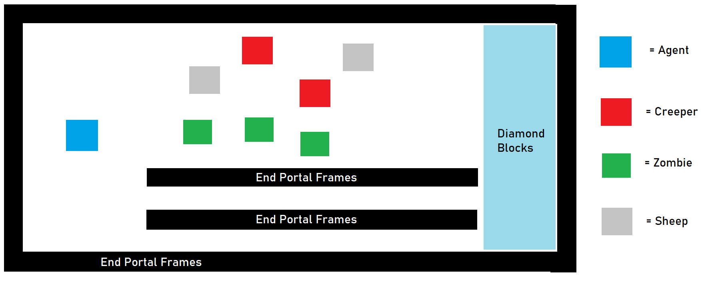

## VIDEO:

## PROJECT SUMMARY: 

The goal of our project is to train our agent to be adept at evading hostile mobs such as zombies, skeletons, and creepers while learning that passive mobs like cows, sheep, and pigs are safe. This is an interesting thing to do because a common issue for Minecraft players is trying to avoid death via hostile mobs in their first few in-game nights. It will be interesting to see if an AI trained with reinforcement learning would be able to mimick the same escape strategies employed by human players.
 
 Our project as of now has an agent in an eclosed room with 2 zombies, 2 creepers and 3 sheeps. The enclosed room has a row of diamond blocks. If the agent reaches any block in this row, the agent wins and gets a reward for the same. The enclosed room also has a path towards the diamond blocks of least resistance i.e devoid of hostile mobs. The agent detects the best path to reach the diamond blocks and escapes the hostile.  

## APPROACH: 
We are training the AI to escape from hostile mobs using reinforcement learning. Our hope is that
the agent will eventually learn to avoid taking damage by using intelligent movements and strategies. 
To train our agent, we are using the
model-free Proximal Policy Optimization (PPO) algorithm. This algorithm uses the following update equation:    

  

We have used three different approaches to train our agent, outlined below. In all approaches, the agent's observation space is a 13 by 13 grid
centered on itself. The agent knows about all entities and blocks within this grid, in order to determine where the passive mobs, the hostile mobs, and 
obstacles are. The agent can respond with one of three actions: turning left in place, turning right in place, or moving forward. However, if the agent 
gets within striking range of any zombies and creepers, it will get attacked and take damage. The mission ends if the agent has taken 200 episode steps 
or if the agent dies from losing all of its health.  

__Baseline__: Our baseline for this project was for an agent to escape a single zombie on an open field. Our agent successfully did this 
by consistently running away from its spawn point in a straight line. While this was a success, it didn't show any complex behavior.
To surpass this baseline, our agent would have to be confined in an enclosed space and made to demonstrate some player-like 
intelligent actions to evade hostile mobs. In addition, its task would be made harder by the addition of multiple zombies and 
creepers.  
<iframe src="https://giphy.com/embed/Whod3huunyABrj9vQo" width="480" height="270" frameBorder="0" class="giphy-embed" allowFullScreen></iframe>
<a href="https://giphy.com/gifs/Whod3huunyABrj9vQo">via GIPHY</a>
  

__Approach&nbsp;#1__:  
This first approach is a very natural follow-up from our baseline. Instead of having an unbounded field where the agent can simply run off in a straight line, 
we wanted to see what would happen if we made the field bounded. We placed our agent was placed in the center of an enclosed 20 by 20 block room, with 5-block-high walls made 
of end portal frames and the floor covered with obsidian. In our prototype where we only dealt with a single zombie, so the floor was stone, but this would not work 
with creepers since stone can be destroyed by creeper blasts. Then, the agent could fall into these craters and become trapped. To avoid this, we 
used blast-resistant blocks. We then spawned in 2 zombies, 2 sheep, and 1 creeper into this room at random locations.  

Since we are training the agent to escape from hostile mobs, the goal is to stay alive for as long as possible. As such, we have 
given the agent the following rewards:  
- +1 for every gametick that the agent stays alive  
- -n for every n healthpoints of damage that the agent takes  

  

This approach has the advantage of being a simple setup, but the agent takes a very long time to train since there is no concrete goal for the agent to accomplish: it just 
has to stay alive.

__Approach&nbsp;#2__:  
Next, we decided to make the environment more interesting. We realized that players often 
make temporary shelters for their initial nights in Minecraft. And when players are caught outside at night, they have to return to it 
without getting killed. To mimick such a scenario, we elongated the field into a football-field-like rectangle, where the agent spawns at one end of the field, the hostile mobs (2 zombies, creepers, and sheep) spawn 
in the middle, and a "touchdown" line of diamond blocks lie at the opposite end of the field. When the agent reaches the diamond blocks, 
it receives a huge positive reward and the mission immediately ends.  Here, our diamond blocks are analogous to a player's base/shelter.

Here, the rewards for the agent were altered. Since we are training the agent to both escape from hostile mobs and to reach the diamond blocks
as fast as possible, we gave the agent the following rewards:  
- -1 for every gametick that the agent stays alive  
- -n for every n healthpoints of damage that the agent takes
- +500 for touching a diamond block  

We hoped that by giving the agent a tangible goal to achieve, we could speed up training time. Unfortunately, this approach has the disadvantage of requiring the agent 
to observe yet another item: the diamond blocks.  

__Approach&nbsp;#3__:  
Finally, out of curiosity, we decided to see if the agent would be able to detect paths of least resistance 
towards the diamond blocks. For example, if there was a completely safe tunnel that was devoid of hostile mobs leading towards the diamond 
blocks, would the agent eventually realize that this was the best path to take? In Minecraft gameplay, this would be analogous to taking 
a well-lit path towards one's base instead of a dark one filled with hostile mobs.  

Here, the rewards for the agent are the same as in Approach #2 since, again, we are training the agent to both escape from hostile mobs and to reach the diamond blocks
as fast as possible.    
- -1 for every gametick that the agent stays alive  
- -n for every n healthpoints of damage that the agent takes
- +500 for touching a diamond block  
 
 

We hoped that by adding a corridor, the agent's training time would be sped up now that it had an area to hide in.  

## EVALUATION:  
### Qualitative 
A good way to evaluate the performance of the agent is to judge how human its strategic decision-making is. For each of our approaches, we 
will see how similarly the actions taken by the agent resemble actions that would be taken by human players if they were placed in the 
same situations.  
__Approach&nbsp;#1__:  
In Approach #1, the agent is stuck in a simple walled room with the mobs. In this situation, a human would absolutely not want to stand in the center, where it would 
attract the maximal amount of hostile mobs. Instead, a human would stick close to the walls, where only 180 degrees of its body is exposed. 
This is what the agent does in this situation. As we can see in the demonstration below, the agent sticks close to the walls and 
continuously circles around the field. This allows it to lead the mobs on a wild goose chase in a circle.  

  

__Approach&nbsp;#2__:  
INSERT DRAWN PIC OF SETUP  
In this approach, the agent is placed on a football-field and has to get past the zombies and creepers in the center to reach the diamond blocks on the opposite side.
To do this, a human might do something similar to a football game, where a player waits for a bit to see if there are gaps in the defense to run through. The 
agent does something similar, as it moves around for a bit at the back of the field to draw the mobs towards it and then suddenly turns around and runs through gaps left by the mobs to reach the diamonds on the 
other side.  

  

__Approach&nbsp;#3__:  
In the third approach, the agent is placed in the same situation as the previous approach (a football field), but this time, we added a corridor. A human would 
see that the most safe choice would be to use the corridor to evade the mobs and get to the diamond blocks on the other side. The agent eventually does exactly this.  

  

Unfortunately, in all approaches, the presence of the passive mob sheep did not seem to play a significant factor in the strategies employed by the agent. We previously believed that the agent might 
use the sheep to hide, but that did not occur.  

### Quantitative  
We have created two graphs to better visualize the agent's improvement. The first graph is a rewards graph, which shows the reward that the agent is able 
to obtain over its training. In order to see how the agent is improving in more detail, we generated a second graph is an average number of enemies graph, 
which shows the average number of hostile mobs within a six block radius of the agent for each episode.  
__Approach#1__: 
  

As we can see, the graph shows that the agent's ability to obtain a higher reward improves over time. At first, the agent 
moves around the field randomly, which leads to a -100 reward. However, as it trains, it is able to reach a much-higher 
reward of 50. We also generated a graph to see how many enemy mobs
are within a 6-block radius of the agent at each step.  
  

Here, we can see that the average number of hostile mobs around the agent decreases noticably throughout training, from 0.8 to 0.4. This indicates
that the agent has learnt to stay away from hostile mobs.
__Approach&nbsp;#2__:  

 
Here, the rewards that the agent is able to obtain increases from -100 to 50 as well.    
  
Meanwhile, the average number of hostile mobs within a 6-block radius decreases from 1.4 to 0.8.  

__Approach&nbsp;#3:(Corridor)__:  
  
Here, the rewards that the agent is able to obtain increases from  increases from -200 to 100.  
  
Meanwhile, the average number of hostile mobs within a 6-block radius decreases from 0.8 to 0.2.  

## REFERENCES:
- [OpenAI PPO Algorithm](https://openai.com/blog/openai-baselines-ppo/) OpenAI's introduction to its PPO algorithm.
- [OpenAI Hide and Seek](https://www.youtube.com/watch?v=Lu56xVlZ40M) Our project is inspired by this interesting AI project.
- [Fighting Zombies in Minecraft with RL Research Paper](http://cs229.stanford.edu/proj2016/report/UdagawaLeeNarasimhan-FightingZombiesInMinecraftWithDeepReinforcementLearning-report.pdf) 
This is an interesting explanation of how to do something slightly similar to what we are attempting.

