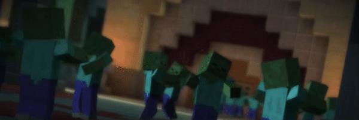

[Source code](https://github.com/rayoh123/Moobloom)

Reports:

- [Proposal](proposal.html)
- [Status](status.html)
- [Final](final.html)

Our team meets at least once every week, at 3:30 PM each Friday

The goal of our project is to train our agent to be adept at evading hostile mobs such as zombies, 
skeletons, and creepers while learning that passive mobs like cows, sheep, and pigs are safe.

Relevant Resources:
- [OpenAI Hide and Seek](https://www.youtube.com/watch?v=Lu56xVlZ40M). Our project will be similar to this interesting 
AI project, except less ambitious in scope. 
- [Fighting Zombies in Minecraft with RL Research Paper](http://cs229.stanford.edu/proj2016/report/UdagawaLeeNarasimhan-FightingZombiesInMinecraftWithDeepReinforcementLearning-report.pdf). 
This is an interesting explanation of how to do something slightly similar to what we are attempting.

[quickref]: https://github.com/mundimark/quickrefs/blob/master/HTML.md
