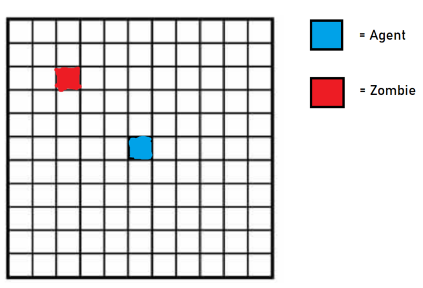
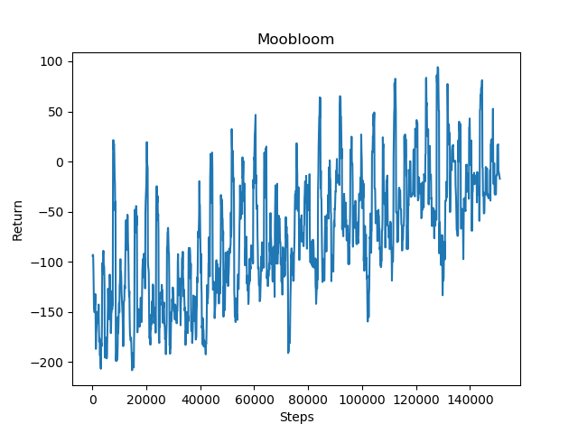
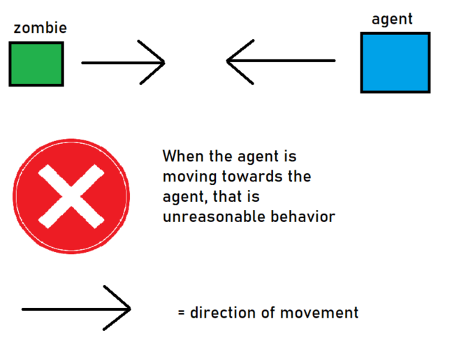
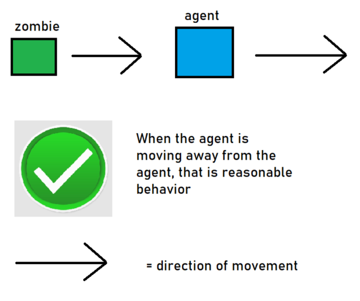

## Project Summary: 
The goal of our project is to train our agent to be adept at evading hostile mobs such as zombies, 
skeletons, and creepers while learning that passive mobs like cows, sheep, and pigs are safe. This is an
interesting thing to do because a common issue for Minecraft players is trying to avoid death via hostile mobs 
in their first few in-game nights. It will be interesting to see if an AI trained with reinforcement learning would 
be able to mimick the same escape strategies employed by human players.

## Approach: 
We are training the AI to escape from hostile mobs using reinforcement learning. Our hope is that 
the agent will eventually learn to maximixe the distance between itself and any hostile mobs. 
The update equation that we use in our project is: WRITE UPDATE EQUATION HERE. 

In our setup, we place the agent in the center of a flat, open field and randomly spawn hostile mobs like zombies on the field. The agent observes a 7 by 7
grid centered on it, and can see any entities in this grid. The agent can respond with one of three actions: turning left in place, 
turning right in place, or moving forward. 

Since we are training the agent to escape from hostile mobs, the goal is to stay alive for as long as possible. As such, the agent receives a positive reward for every 
gametick that it remains alive. Additionally, since taking damage is detrimental to the goal of escaping from mobs, the agent receives a negative reward
whenever it takes damage from a hostile mob. Therefore, the reward function that we use is: WRITE REWARD FUNCTION HERE.

## Evaluation:
We can evaluate our agent's performance quantitatively by comparing the agent's average reward near the beginning of its 
training to its average reward near the end of its training. If there is a noticable and significant increase in average 
reward, that is good. If there is no increase in average reward, that is bad. Here is a chart of the agent's average reward over time: 

We can evaluate our agent's performance qualitatively by seeing if the agent takes a reasonable course of action when it is near a hostile mob. Namely, 
when the agent encounters a hostile mob, it should immediately turn and move in the opposite direction. If the agent moves perpendicular to the mob's 
path towards the agent, that is bad. Our agent BLAH BLAH.
 

## Remaining Goals and Challenges:
Our current prototype is limited because it performs the humanly easy task of escaping from a single zombie. In a regular game of Minecraft, 
a human player will have to encounter more than one zombie. He or she will have to handle escaping from hostile mobs like skeletons and 
creepers as well, both of which have harming capabilities that are more dangerous than that of zombies. 

Some improvements that we hope to make to our agent will be to change the discrete agent that we currently have to handle continuous movements. 
If the agent moves smoothly, it might be able to avoid mobs better. In addition, we plan to add additional reward conditions so that the agent can
more quickly learn to stay far away from hostile mobs. For example, we are considering adding a negative reward the closer the agent is to a zombie.
Finally, we hope to change the agent's observation space so that it can also observe skeletons and creepers as well.  

One challenge that we anticipate is a potentially very long training time for the agent. With one zombie, the agent takes more than a hundred-thousand
steps to start demonstrating noticable improvement in surviving. We are concerned that once we switch to a continuous agent (as opposed to discrete) and add
skeletons and creepers, the time it will train the agent will balloon to something that is unreasonable. This would be very crippling, as there would be no feasable
way for us to train the agent with our PCs. A solution to this problem would be to quickly create a continuous agent that can handle surviving 
skeletons and creepers, and see how long it takes to train. If it takes too long, than we would change our goal to something less ambitous.

Another difficulty is figuring out how to change the training so that the agent can accomodate skeletons. Unlike zombies, skeletons can attack at a far range
(about 15 blocks), so it would prove a challenge for the agent to realize that it should stay much, much further away from skeletons than zombies and creepers. 
We would need to figure out what new rewards we can add to ensure that the agent realizes that it has to stay a far distance away from skeletons. 

## Resources Used:
- [OpenAI Hide and Seek](https://www.youtube.com/watch?v=Lu56xVlZ40M). Our project will be similar to this interesting 
AI project, except less ambitious in scope. 
- [Fighting Zombies in Minecraft with RL Research Paper](http://cs229.stanford.edu/proj2016/report/UdagawaLeeNarasimhan-FightingZombiesInMinecraftWithDeepReinforcementLearning-report.pdf). 
This is an interesting explanation of how to do something slightly similar to what we are attempting.